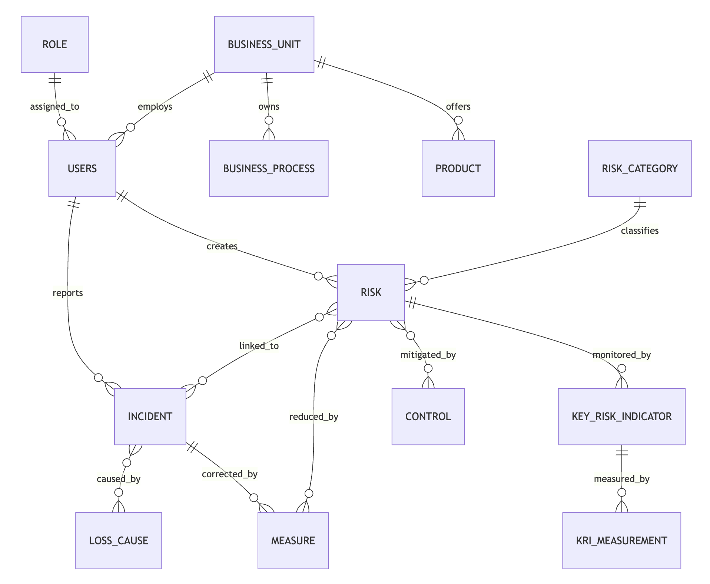

# Design Document

By Volodymyr I.

Video overview: <[URL HERE](https://youtu.be/Yw05nbFrnjc)>

## Scope

The database for a risk management software includes necessary core entities to ensure an operational risk framework in a bank (or a company). This framework typically includes incident registration and analysis (risk assessment), tracking of risk mitigation measures, risk identification and assessment, key risk indicators (risk monitoring), management reporting, risk capital modelling, and more. Due to high complexity, number of implemented components of the framework in this project will be limited. 

What is included in the scope:

* Users and organization:
* * Users, including their unique usernames, email addresses, roles, and associated business units.
* * Business units, stored hierarchically to reflect company organizational structures.
* * Business processes, also stored hierarchically and linked to business units, to capture operational workflows and responsibilities.
* * Products, linked to business units.
* Core risk-related entities:
* * Incidents (loss event): represent operational risk events, including title, description, occurrence and discovery timestamps, financial impact, near-miss flag, related business unit, process, product, status, workflow (reported, validated, closed), and optional soft deletion data (deleted_at and deleted_by). Soft deletion is critical for preserving historical data while enabling safe removal of erroneous entries.
* * Risks: include a textual description, risk category, association with business units, processes, and products, and inherent/residual likelihood and impact ratings (1–5).
* * Controls: Describe existing risk mitigation measures, their effectiveness (1–5), associated business processes, and creation metadata.
* * Measures: include corrective or preventive actions, responsible user, deadline, status, creation and update timestamps, closure comments, and ability to link to incidents or risks.
* * Key risk indicators (KRIs): represent measurable metrics tied to risks, with thresholds for green/amber/red levels, measurement frequency, responsible users, and a log of historical measurements (kri_measurement table).
* Link tables (many-to-many):
* * incident_risk: link incidents to associated risks.
* * incident_measure: link incidents to corrective measures.
* * incident_cause: link incidents to multiple loss causes.
* * risk_control: link risks to associated controls.
* * risk_measure: link risks to preventive or corrective measures.
* Reference tables:
* * role: Defines user roles to manage permissions (e.g., Risk Manager, Business Unit Owner, Auditor).
* * risk_category: Business-friendly classification of risks (e.g. IT risk, Compliance risk, Fraud risk, etc.).
* * loss_cause: Identifies root causes of risk events ("why it happened").

To satisfy regulatory and operational needs, the design includes a soft deletion mechanism for sensitive tables like incidents (prevents accidental data loss).

I leave out of scope advanced reporting and analytics, capital modelling, integration with external systems, and many more other possible features for obvious reasons: it's already way too complex!! 

## Functional Requirements

This database will support:

* CRUD operations for entities.
* A complete workflow for incident registration and analysis (e.g. reported by user → confirmed and submitted by its manager → verified, validated and closed by risk team).
* Risk management operations: Define and manage risks, link them to incidents, controls, and measures.
* Measure management: Track deadlines, responsible users, completion, and closure comments.
* KRI monitoring: Record measurements, compute thresholds, and store historical values for trend analysis.
* Linkage management: Establish many-to-many relationships between incidents, risks, measures, controls, and causes.
* Soft deletion: Mark critical records as deleted without removing them from the database.

Beyond the scope of this MVP:
* Detailed audit log for the most critical data (often required by regulators).
* Advanced reporting, dashboards, or analytics beyond storing raw data.
* Complex workflows or business rules (only incident lifecycle statuses).
* Automated calculation of risk exposure, capital allocation, or predictive risk analytics.

## Representation

### Entities

The primary entities in the database, their attributes, and rationale:

#### Users

The `users` table includes:
* Attributes: id, username, email, full_name, role_id, business_unit_id, is_active, created_at.
* Constraints: username and email are unique; role_id and business_unit_id are optional to allow flexible assignment; is_active flags active users.
* Rationale: Stores basic identity and organizational assignment; supports permission management.

#### Business Units & Processes:

* Attributes: id, name, parent_id (self-referencing), optional link to business unit for processes.
* Rationale: Hierarchical structures capture real-world company organization; self-referencing parent IDs support nested hierarchies.

#### Products:

* Attributes: id, name, business_unit_id.
* Rationale: Products are tied to business units and optionally associated with processes, enabling risk mapping at the product level.

#### Roles:

* Attributes: role_id, name.
* Constraints: Unique names.
* Rationale: Support access control and permission management.

#### Risk Categories:

* Attributes: id, name (risk_category).
* Rationale: Supports classification for reporting.

#### Loss Causes:

* Attributes: id, name, description.
* Rationale: Identifies root causes of incidents for analysis.

#### Risks:

* Attributes: id, description, risk_category_id, business_unit_id, business_process_id, product_id, inherent_likelihood, inherent_impact, residual_likelihood, residual_impact, created_by, created_at, updated_at.
* Constraints: Likelihood and impact values constrained to 1–5; foreign keys ensure referential integrity.
* Rationale: Represents potential events that could impact business; rating scales are numeric for consistency and calculations.

#### Incidents:

* Attributes: id, title, description, start_time, end_time, discovered_time, registered_time, business_unit_id, business_process_id, product_id, status_id, reported_by, validated_by, validated_at, closed_by, closed_at, deleted_at, deleted_by, gross_loss_amount, recovery_amount, net_loss_amount, currency_code, near_miss, notes.
* Constraints: deleted_at and deleted_by used for soft deletion; foreign keys maintain links to users, units, processes, products, statuses.
* Rationale: Captures both operational and financial aspects of risk events; soft deletion ensure traceability.

#### Controls & Measures:

* Controls track existing mitigation; Measures track planned actions (preventive or corrective).
* Attributes: IDs, descriptions, effectiveness (controls), status, responsible user, deadlines, created/updated timestamps.
* Rationale: Supports proactive and reactive risk management.

#### Key Risk Indicators (KRIs):

* Attributes: id, name, definition, unit, threshold_green/amber/red, frequency, responsible_id, risk_id, created_at, updated_at, active.
* Rationale: Measures risk exposure over time, identifies trends, and enables monitoring against thresholds.

#### Link Tables:

Support many-to-many relationships between incidents, risks, measures, controls, and causes.

### Relationships

Entity Relationship diagram (simplified):

[Users]---<belongs_to>---[BusinessUnit]---<has>---[BusinessProcess]
   |                                 
   |                                  
   v                                   
 [Incidents]---<linked_to>---[Risks]---<controlled_by>---[Controls]
   |          \             /    \
   |           \          /       \
   v            v       v          v
[Causes]       [Measures]        [KRIs]---<measurements>---[KRI_Measurement]

Entity Relationship diagram (logically grouped, core relationship)

The database follows a normalized relational design:
* Users → Business Units: many users belong to one business unit.
* Users → Roles: many users have one role.
* Business Units → Business Processes: one-to-many, processes belong to units.
* Business Units → Products: one-to-many, products belong to units.
* Incidents → Business Unit / Process / Product: one-to-many.
* Incidents → Risks / Measures / Causes: many-to-many via link tables (incident_risk, incident_measure, incident_cause).
* Risks → Controls / Measures: many-to-many via risk_control and risk_measure.
* KRIs → Risks: one-to-many, each KRI is tied to a single risk but can have multiple measurements.

## Optimizations

To ensure efficient data retrieval and reporting, the database provides:

#### Indexes:

* Incident lookups: business_unit_id, status_id.
* KRI measurements: (kri_id, period_start, period_end) to efficiently query by indicator and period.
* Controls and measures: indexing on business_process_id and responsible_id for quick assignment lookups.
* More indexes were created while testing typical queries(denoted in query.sql).

#### Views:

* active_incident: Filters out soft-deleted incidents (deleted_at IS NULL) to simplify queries for active events.

#### Constraints:

* Enforce foreign key integrity, value ranges (likelihood, impact, KRI thresholds, frequency), and uniqueness where necessary (roles, usernames, emails).
* Soft deletion prevents data loss.

#### Triggers:

* Soft delete triggers mark records as deleted instead of removing them.

These optimizations balance query performance, historical traceability and maintainability, important for risk management domain.

## Limitations

MVP has some limitations:
* advanced features are not covered (e.g. advanced analytics, dashboards, capital modeling)
* soft deletion is not universal: while implemented for incidents, other tables may require additional triggers and deleted_at/deleted_by columns for full soft deletion coverage.
* only basic incident lifecycle workflows are supported; more complex approval or escalation workflows would require application-level logic or additional tables.

Nonetheless this design provides a solid foundation for future enhancements. 
And for now it allows safe core risk management operations. 
